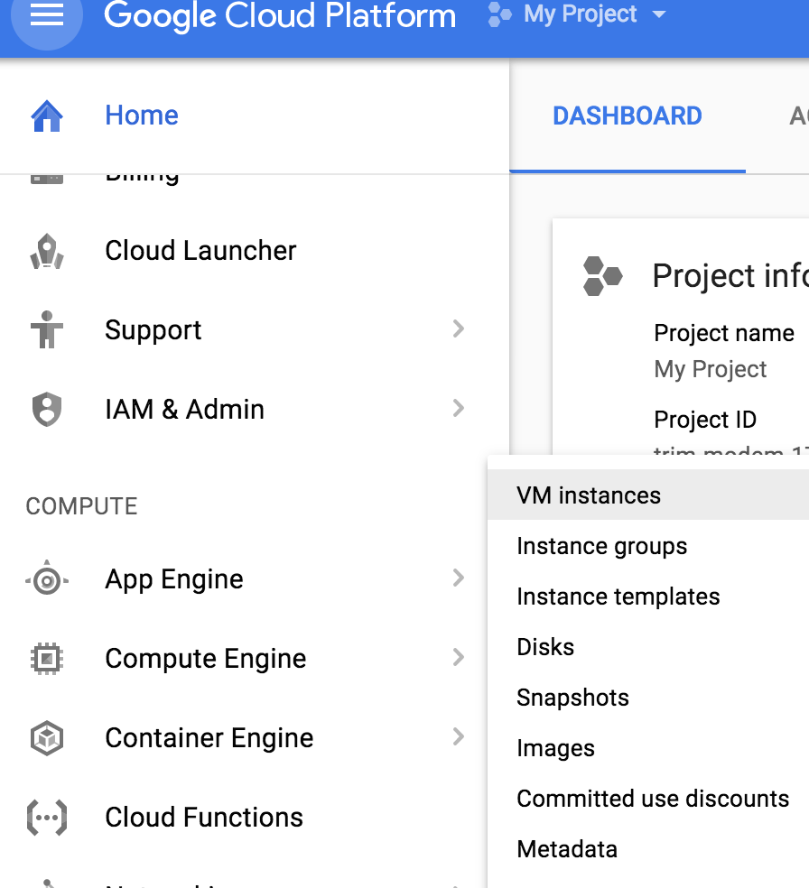
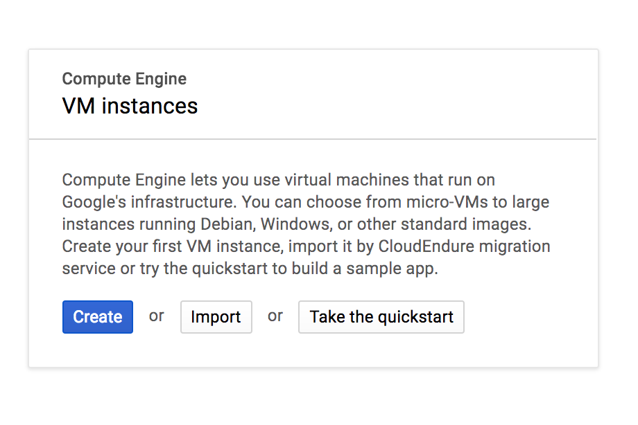
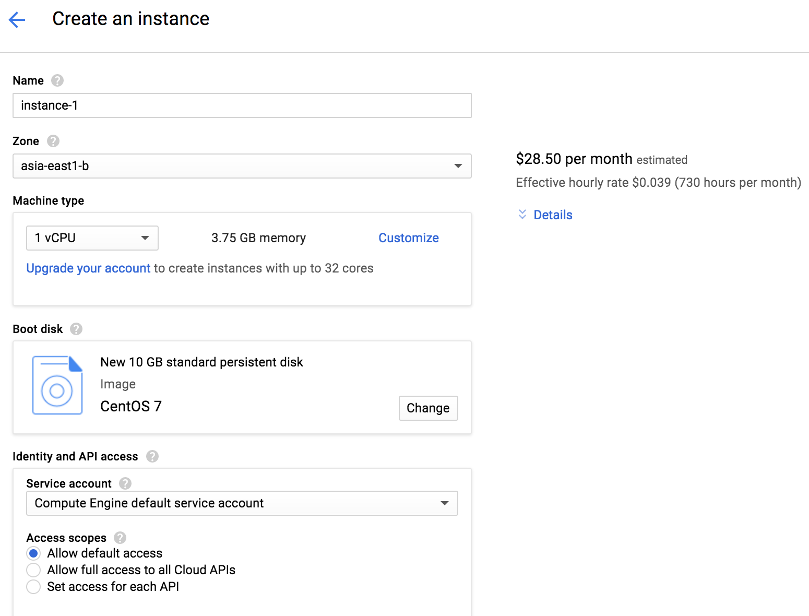
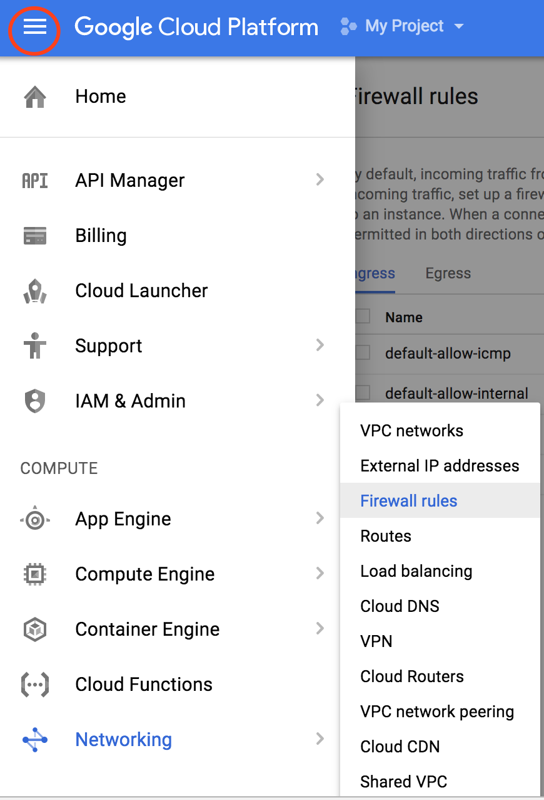
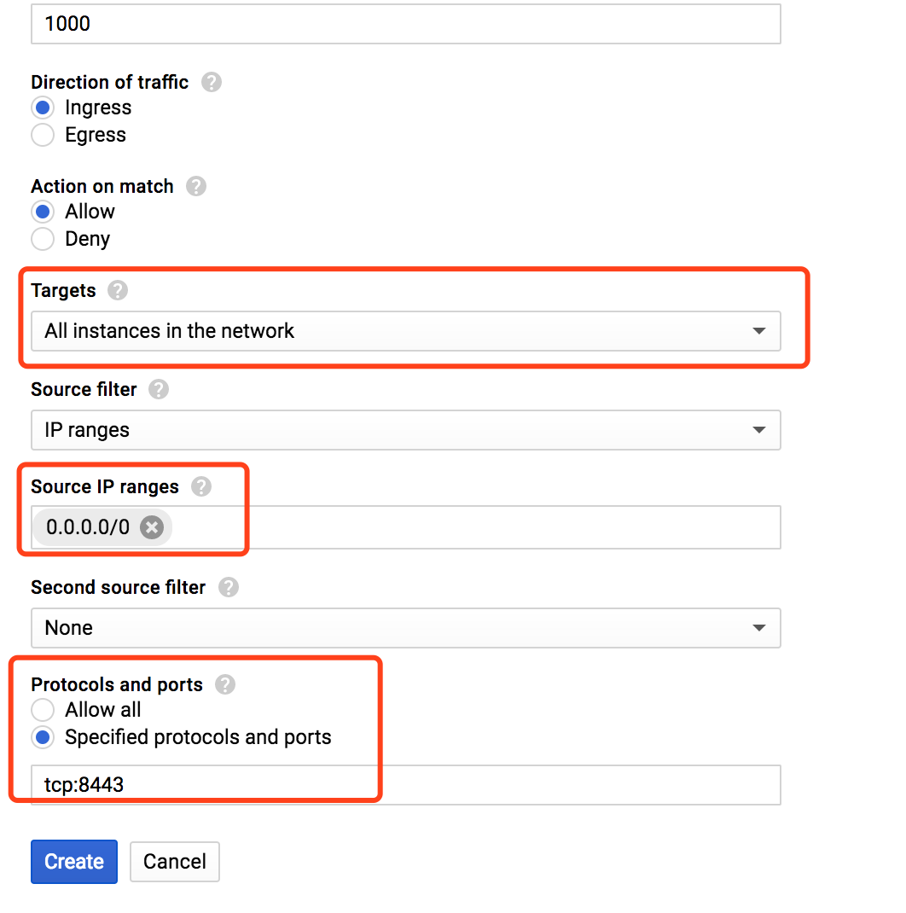
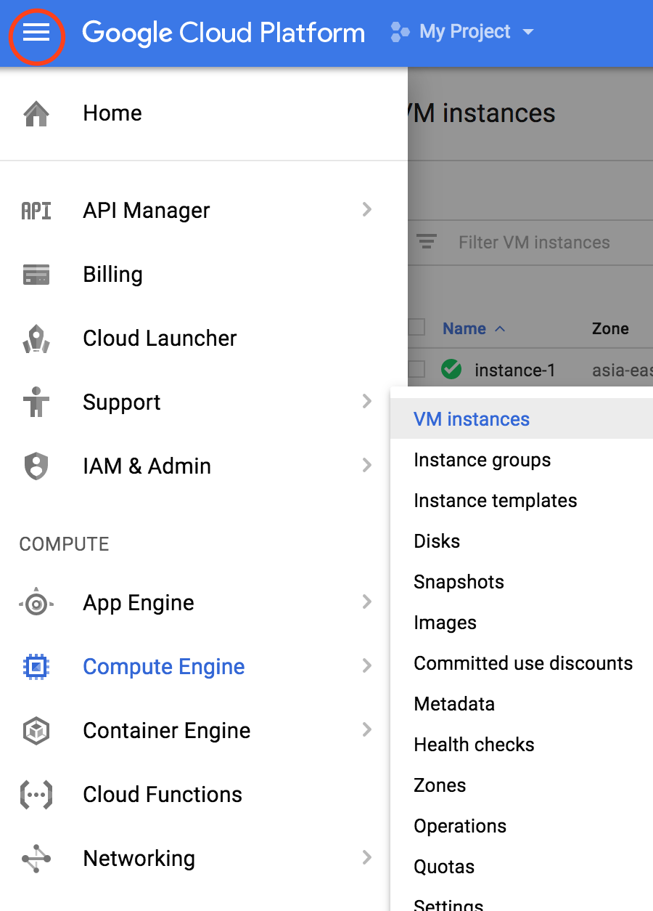
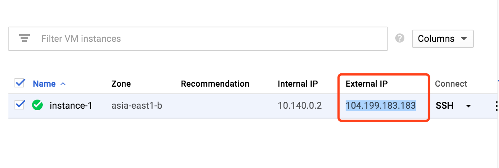

Title: 使用 gcloud 搭建免费一年的高速 shadowsocks 服务
Date: 2017-7-23 10:40
Slug: build a one-year-free shadowsocks service with gcloud
Category: misc
Tags: misc
Author: Qunhao Song
Summary:  使用 gcloud 搭建免费一年的高速 shadowsocks 服务

由于购买的 shadowsocks 服务不是很稳定，偶尔会抽风，速度也不可观，因此萌发了自己搭建 shadowsocks 服务的想法。正好发现 gcloud 提供免费一年的服务试用，所以我们可以使用 google 的云服务器来搭建自己的 shadowsocks 服务。测试之后发现结果确实比购买的服务好很多，速度可以支持 youtube 以1080画质稳定播放视频。

所需条件：

  1. 需要一个 google 账号。
  2. 目前能访问 gcloud 网站。（可以使用 hosts 文件，购买的 shadowsocks 服务或者 VPN）
  3. 需要一张 Visa 或者 Master 的信用卡，信用卡不会被主动扣费，只是激活免费账户是需要该信息，一年免费期到了之后取消服务即可。

首先访问 https://console.cloud.google.com，并登陆 google 账户。
可以看到 gcloud 的优惠信息展示在页面最上面。

点击 SIGN UP FOR FREE TRAIL 的按钮然后选择同意服务来下一步。
填写地址和信用卡信息，按 google 的说法，即使你用完了预赠的300美元，google 也不会在你主动给出允许之前扣你的信用卡，所以即使是服务到期或者花完了免费的额度也不用担心。填完之后就可以开启免费服务。

然后可以看到欢迎信息，如果你想更全面地了解一下 gcloud，可以点左边的 TOUR THE CONSOLE, 不然就点右边的 GOT IT.

在左边的导航栏里找到 Compute Engine, 鼠标移上去之后在新出现的框内选择 VM Instances。

新的页面会让你选择或新建一个 Project, 点击新建即可，等待一段时间之后可以看到如下页面。

点击 create。
这时候我们需要对新的云服务器进行配置。名称用默认的就可以。Zone 的选择的话，按网上的一些说法，选择离所在地区比较近的区域可以让延迟更小，但是我自己并没有做过对比，有兴趣对比的同学可以把结果发到底下评论区。这边我们可以选择最上面的 asia-east1, a b c 当中的任意一个。为了方便起见，我在 Machine Type 中选择了1 vCPU，选完之后可以看到对应的预计花费，28.5美元一个月，一年的花费超过了300美元。因为我们赠送的300美元必须要在第一年内使用完，因此可以点击 Customize 手动的调整一下机器的内存大小，使得每个月的预计花费在25美元左右。Boot disk 我们选择 Centos 7。剩下的就按默认配置选择。

创建完之后我们点击这个 instance 对应的 SSH 按钮连接。
进入命令行之后首先输入以下命令安装 pip。

    :::bash
    sudo yum install -y python-pip

然后安装 shadowsocks。

    :::bash
    sudo pip install shadowsocks

接下来就可以启动服务了。

    :::bash
    ssserver -p 8443 -k password -m aes-256-cfb --user nobody -d start

这条命令中，`-p` 之后的数字表明服务启动的端口，例子里是8443，`-k` 之后的信息是该服务的密码，可以修改成自己喜欢的密码。`-m` 代表的是 shadowsocks 加密方式，推荐使用`aes-256-cfb`。这三个信息我们后面还会用到，所以最好记录一下。最后的几个参数是为了让服务在后台运行，避免 SSH 连接超时自动断开服务。

还剩最后一步我们的服务器就搭建完成了。先不要关闭命令行界面，回到 gcloud 的主页面，选择左上角的三横线，然后选择 Networking，然后选择 Firewall Rules。

进入页面之后点击 CREATE FIREWALL RULE。
给这个防火墙规则一个名字，shadowsocks。然后在 Targets 选项中选择 `All instances in the network`，在 Source IP Range 这个框里填上 `0.0.0.0/0`，表明该规则运行任何 IP 地址访问。最后在 Protocols and ports 里面选择 Specified protocols and ports，下面的输入框填入 `tcp:8443`，这里的8443代表之前我们开启服务所用的端口，如果你上面开启服务用的是另一个，那就填那一个端口而不是8443。其他的配置都按默认。

这个时候我们再回 instance 的页面看一眼服务器的外部地址，就大功告成了。

到这里服务器端的配置就全部完成了，我们需要记录四个东西，以便在客户端连接服务器：

1. 最后一张图片显示的服务器外部地址 （如`10.199.183.183`）
2. 启用服务的端口号 （如`8443`）
3. 服务密码 （如`password`）
4. 加密方式 （如`aes-256-cfb`）

### 客户端
客户端的使用比较简单，MacOS 客户端推荐使用 [shadowsocksX-NG](https://github.com/shadowsocks/ShadowsocksX-NG)，iOS端推荐使用免费的 App: [Wingy](https://itunes.apple.com/us/app/wingy-shadow-vpn-for-http-socks5-ss/id1148026741?mt=8),配置都是图形界面化的，类型选择 shadowsocks(R)，然后将上面提到的4段信息输入即可。
我自己没有在 Windows 上测试过，关于 Windows 的客户端的安装和配置可以看这里 [Windwos客户端](https://github.com/shadowsocks/shadowsocks-windows/wiki/Shadowsocks-Windows-%E4%BD%BF%E7%94%A8%E8%AF%B4%E6%98%8E)。
